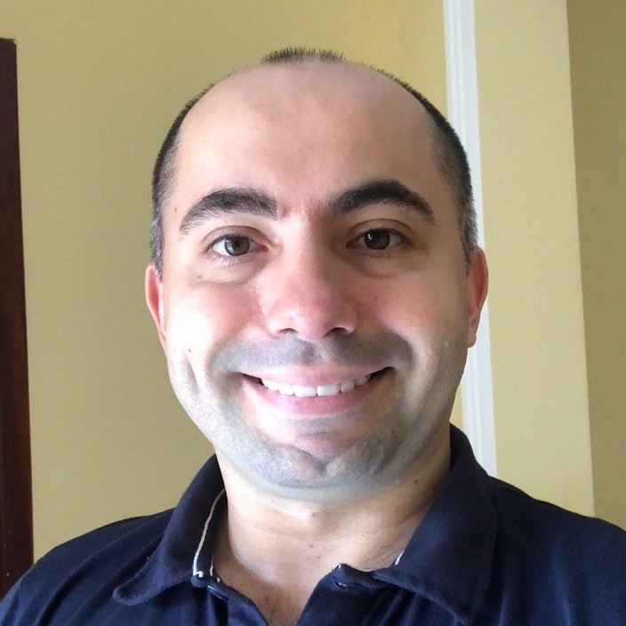

```{r setup, include=FALSE}
knitr::opts_chunk$set(echo = TRUE)
```

## Jorgiane Pires Bezerra

{width=30%}

Mestranda no Programa de Pós-Graduação em Engenharia Civil com ênfase em Recursos Hídricos na Universidade Federal do Ceará. Graduada em Engenharia Ambiental e Sanitária pelo Instituto Federal de Educação, Ciência e Tecnologia do Ceará.

Atuou como bolsista de iniciação cientifica na Empresa Brasileira de Pesquisa Agropecuária e como pesquisadora na modalidade de bolsa de transferência tecnológica na Fundação Cearense de Meteorologia e Recursos Hídricos. 

Tem experiência em:

- avaliação de impactos ambientais de processos e produtos agroindustriais; 
- delimitação automática de elementos de drenagem com integração em linguagem Python;
- modelagem hidrológica distribuída utilizando o modelo MGB-IPH.

## Franciso Chagas Vasconcelos Junior

{width=30%}

Possui graduação em Física Licenciatura Plena pela Universidade Estadual do Ceará (2007), mestrado em Ciências Físicas Aplicadas pela Universidade Estadual do Ceará (2010) e doutorado em Meteorologia pela Universidade de São Paulo (2014). 

Tem experiência em:

- Meteorologia Física;
- Meteorologia Dinâmica;
- Modelagem Numérica de Mesoescala;
- Técnicas de downscaling sobre o Nordeste Brasileiro. 

Trabalha com variabilidade da Precipitação sobre o Nordeste do Brasil, além de Modelagem Climática Regional sobre o América do Sul. 

Fez Pós-Doutorado na área de Clima e Recursos Hídricos no departamento de engenharia hidráulica da Universidade Federal do Ceará trabalhando com previsão de vazão natural afluente em reservatórios no semi-árido e índices de seca. 

Atualmente é pesquisador na Fundação Cearense de Meteorologia e Recursos Hídricos, trabalhando com modelagem Atmosférica de Tempo e Clima, impactos de mudanças no clima na região Nordeste, além do desenvolvimento de produtos operacional para agricultura e recursos hídricos no semi-árido.

Faz parte também do corpo docente do Mestrado Profissional em Climatologia e Aplicações nos Países da CPLP e África na Universidade Estadual do Ceará.

## Dirceu Silveira Reis Junior

Dirceu é Professor do Departamento de Engenharia Civil e Ambiental da Universidade de Brasília. Ele tem trabalhado com análise e gestão de risco em recursos hídricos, com foco no desenvolvimento e aplicação de metodologias que descrevam as incertezas na estimativas de extremos hidrológicos e na avaliação de políticas ou estratégias operativas.  

{width=30%}

## Eduardo Sávio Passos Rodrigues Martins

